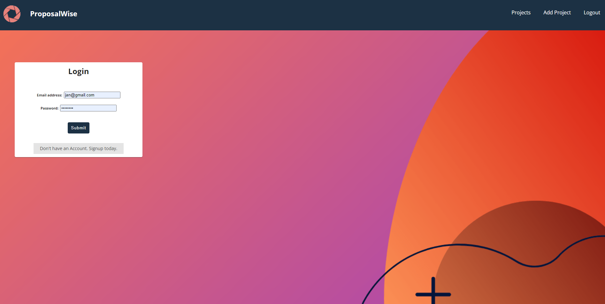
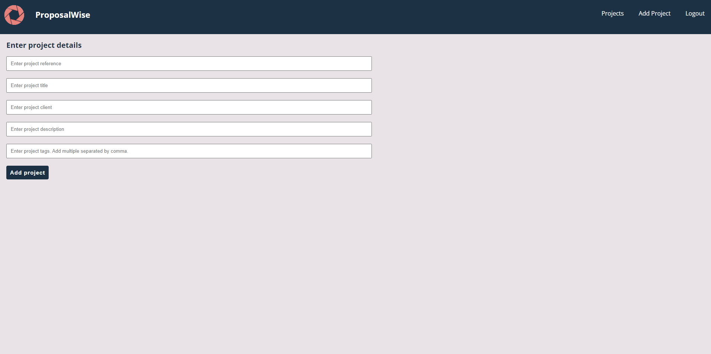
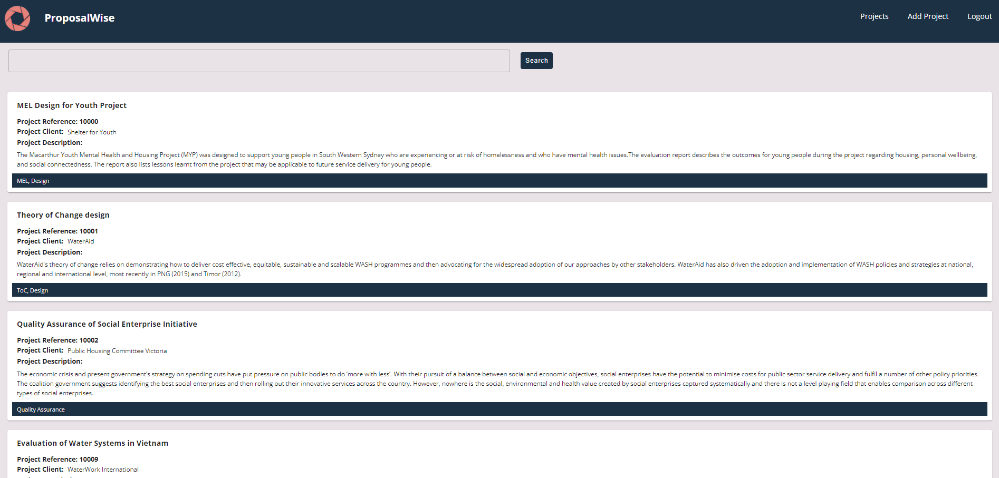

# ProposalWise: Proposal Content Generator

The ProposalWise offers a knowledge management system and proposal content generator in one application. It is designed for the consulting sector to enable users to keep track of their projects, and easily compile project information which they can then use to then develop their proposal.

## Technology Used

* MERN
* Apollo Client
* GraphQL
* MongoDB Atlas

## User Story

```
As a Consultant, I WANT to be able to view, create and delete past project descriptions.

As a Consultant, I WANT to be able to search for projects that are relevant to me.
```

## Deployed site

[Visit the website: ProposalWise](https://proposalwise.herokuapp.com/) 







## Future development

* Fix current bugs in search, delete and update functionality.

* Enable users to select projects that they can then export as a Word Document using technology such as DOCX.JS.

* Integration with existing project management software systems so that project details are preloaded, and users only have to add in relevant project descriptions and case studies related to a project.

* While this is a web-based application, improve responsiveness and provide better user experience for users across devices. 

## Licenses

* MIT